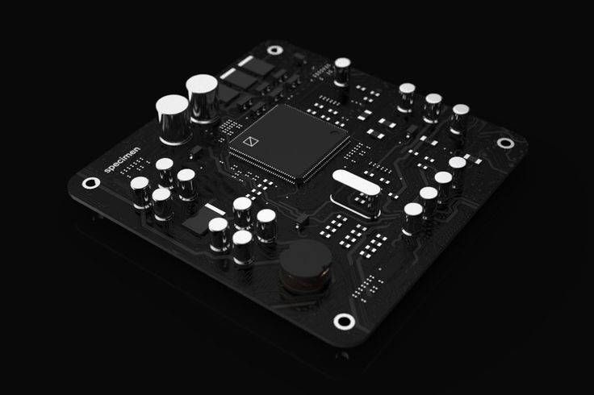

<h3 align="center">Embedded System Roadmap</h3>

# Curriculum

**Curriculum version**: `1.0.0`

- [Prerequisites](#prerequisites)
  - [Computer Science](#computer-science)
  - [Digital Design](#digital-design)
  - [Electronics](#electronics)
- [Introduction to Embedded Systems](#introduction-to-embedded-systems)
  - [Embedded Systems Concepts](#embedded-systems-concepts)
  - [Introduction to MCU Interfacing](#inroduction-to-microcontroller-interfacing)
- [In Depth Embedded Systems](#in-depth-embedded-systems)
  - [ARM MCUs Interfacing](#arm-mcus-interfacing)
- [Real Time OS](#real-time-os)
- [Autosar](#autosar)
- [Software Design](#software-design)

---

## Prerequisites
The Embedded Systems software engineer need to have solid knowledge of `CS`.

And a good knowledge of `degital design` and `electronics`.

## Computer Science
- [Intro to CS](#intro-to-cs)
- [The C Programming Language](#the-c-programming-language)
- [Data Structure and Algotithms](#data-structure-and-algotithms)
- [Problem Solving Mindset](#problem-solving-mindset)
- [Operating Systems](#operating-systems)
- [others](#others)

### Intro to CS
#### study one of the following courses (CS50 is recommended)
these courses will give you the basic knowledge of the fields of computer science and programming
- [CS50: Computer Science Courses and Programs from Harvard](https://www.edx.org/cs50)
- [Introduction to Computer Science and Programming in Python](https://ocw.mit.edu/courses/6-0001-introduction-to-computer-science-and-programming-in-python-fall-2016/)

### The C Programming Language
#### study the following books
first one is to teach you the C language. You can follow playlist linke [Neso Academy](https://www.youtube.com/watch?v=4OGMB4Fhh50&list=PLBlnK6fEyqRhX6r2uhhlubuF5QextdCSM)
second is to give you a solid knowledge in pointers (the most important topic in C programming)
- [C Programming A modern Approach](https://www.amazon.com/C-Programming-Modern-Approach-2nd/dp/0393979504)
- [Understanding and Using C Pointers](https://www.amazon.com/Understanding-Using-Pointers-Techniques-Management/dp/1449344186)

#### practice writing C programs on the following websites
- [Hacker Rank](https://www.hackerrank.com/)
- [IndiaBix](https://www.indiabix.com/)
- [San Foundry](https://www.sanfoundry.com/)

### Data Structure and Algotithms
#### study the following book
this book will give you the basic knowledge of the field of data structure and algorithms
- [Grokking Algorithms](https://www.amazon.com/Grokking-Algorithms-illustrated-programmers-curious/dp/1617292230)

#### study one of the following cources of discrete mathematics (Dr Waleed is recommended)
these courses are not mandatory but it is better to study first one (dr waleed)
- [MA 112: Discrete Mathematics I (logic, basics, and foundations)](https://github.com/DrWaleedAYousef/Teaching/tree/master/DiscreteMathematics)
- [Mathematics for Computer Science](https://ocw.mit.edu/courses/6-042j-mathematics-for-computer-science-fall-2010/)
- [Descrete Mathematics Neso-Academy](https://www.youtube.com/watch?v=p2b2Vb-cYCs&list=PLBlnK6fEyqRhqJPDXcvYlLfXPh37L89g3)

#### study the following course
this course will give you what you need to implement the famouse data structures with C
- [CS 214: Data Structures](https://github.com/DrWaleedAYousef/Teaching/tree/master/DataStructures)

#### if you want to get advanced study one of the follwoing courses
these course will change your mindset but these courses are not mendatory you can learn from problem soulving
- [Introduction to Algorithms](https://ocw.mit.edu/courses/6-006-introduction-to-algorithms-spring-2020/) 
- [Algorithms Specialization](https://www.coursera.org/specializations/algorithms?page=9)

### Problem Solving Mindset
#### you need to practice your mind how to solve programmable problems
there are alot of sheets and ways to practice but this sheet is, i think, enough
I recommend [Al-Azhar sheet](https://sites.google.com/view/azharicpc/) and go with its progress

#### you can learn DS & ALGO through solving
- [LeetCode](https://interview.leetcode.com/interview/?gclid=CjwKCAjwvNaYBhA3EiwACgndggVHD-TZV0xhKDm30cLEFvO-hVww5R5XobFp5Pe4b8m87O153xU22hoCHQQQAvD_BwE) is a good website to practice and learn

### Operating Systems
#### you can follow the [Core Systems](https://github.com/ossu/computer-science/blob/master/README.md#core-systems) in [OSSU](https://github.com/ossu)
os is one of the most important fields that you should have a good knowledge in it because the [RTOS](#rtos) is just an operating system

### Others
#### you can get some knowledge about
- Networks
- OOP
- Data-bases
- [The Missing Semester of Your CS Education](https://missing.csail.mit.edu/) tobics like `terminals and shell scripting`, `vim`, `command line environments`, `version control`, and `more` are covered

## Digital Design
#### study the following course
you need to have a good knowledge in this field to understand the architecture of the MCU and the organisation of its componenets
- [CS 221: Digital Design](https://github.com/DrWaleedAYousef/Teaching/tree/master/DigitalDesign)

## Electronics
#### if you feel that you have enough knowledge, skip this section.
#### you can return to the following book
- [The Art of Electronics](https://www.amazon.com/Art-Electronics-Paul-Horowitz/dp/0521809266)

---
the following parts are the core of embeddid systems
## Introduction to Embedded Systems
at the beginnig i recommed you to stress in this topic because the next one depends on this one.

you need to have a solid knowledge of `ES concepts` and `MCU interfacing`
- [Embedded Systems Concepts](#embedded-systems-concepts)
- [Introduction to MCU Interfacing](#inroduction-to-microcontroller-interfacing)

## Embedded Systems Concepts
#### study the following book
this book will give you the first step in the field of embedded systems
- [Programming Embedded Systems](https://www.amazon.com/Programming-Embedded-Systems-Development-Tools/dp/0596009836)

## Inroduction to Microcontroller Interfacing
in this topic learn interfacing with `8-bit` microcontroller first
### remember learn the concepts not the mcu, if you did then you can deal with any datasheet of any mcu
#### you can take one of the following programs
these programs are allowed if you are Egyptian (you can find the contents if it is allowed)
- [NTI](https://www.nti.sci.eg/dey/) (AVR module)
- [ITI summer diploma](https://www.iti.gov.eg) (starts in summer)
- [egFWD professional track](https://egfwd.com/specializtion/professional-embedded-systems/?utm_source=googlesearch&utm_medium=ads&utm_campaign=branding&utm_adgroup=fwd&gclid=Cj0KCQjw39uYBhCLARIsAD_SzMQEA53h9VoakBL5zqyxX0F4_PoqEGWU0a5UoYbr6fNw2nOstQmZXsgaAnsoEALw_wcB)

#### study one of the following books (Mazidi is recommended)
- [AVR Microcontroller and Embedded Systems](https://www.amazon.com/AVR-Microcontroller-Embedded-Systems-Electronics/dp/0138003319) (chapter seven is your real start)
- [Make: AVR Programming](https://www.oreilly.com/library/view/make-avr-programming/9781449356484/)

---
## In Depth Embedded Systems
now you have got a sense of what is embedded systems. and you now know what is missing in your education

## ARM MCUs Interfacing
### in progress
#### study the following books
- [An Embedded Software Primer](https://www.amazon.com/Embedded-Software-Primer-David-Simon/dp/020161569X)
- [The Definitive Guide to ARM](https://www.amazon.com/Definitive-Guide-Cortex%C2%AE-M3-Cortex%C2%AE-M4-Processors/dp/0124080820)

#### study the following courses
- [Embedded Systems Programming on ARM Cortex-M3/M4 Processor](https://www.udemy.com/course/embedded-system-programming-on-arm-cortex-m3m4/)
- [Mastering Microcontroller and Embedded Driver Development](https://www.udemy.com/course/mastering-microcontroller-with-peripheral-driver-development/)
- [Mastering Microcontroller: Timers, PWM, CAN, Low Power(MCU2)](https://www.udemy.com/course/microcontroller-programming-stm32-timers-pwm-can-bus-protocol/)

#### you can take one of the following programs
- [NTI](https://www.nti.sci.eg/dey/) (ARM module)
- [egFWD advanced track](https://egfwd.com/specializtion/advanced-embedded-systems/?utm_source=googlesearch&utm_medium=ads&utm_campaign=branding&utm_adgroup=fwd&gclid=Cj0KCQjw39uYBhCLARIsAD_SzMQEA53h9VoakBL5zqyxX0F4_PoqEGWU0a5UoYbr6fNw2nOstQmZXsgaAnsoEALw_wcB)

---

## Real Time OS
### in progress
#### you can study the following books
- [MicroC OS II: The Real Time Kernel](https://www.amazon.com/MicroC-OS-II-Kernel-CD-ROM/dp/1578201039)
- [Mastering the FreeRTOS Real Time Kernel](https://www.goodreads.com/en/book/show/41725681-mastering-the-freertos-real-time-kernel---a-hands-on-tutorial-guide)

#### study the following course
- [Introduction to Real-Time Operating System (RTOS)](https://www.udemy.com/course/introduction-to-rtos/)

---

## Autosar
### in progress

---

## Software Design
### in progress

---

# NOTE !!!
### this roadmap developed based on my opinion and influenced by my instructors
